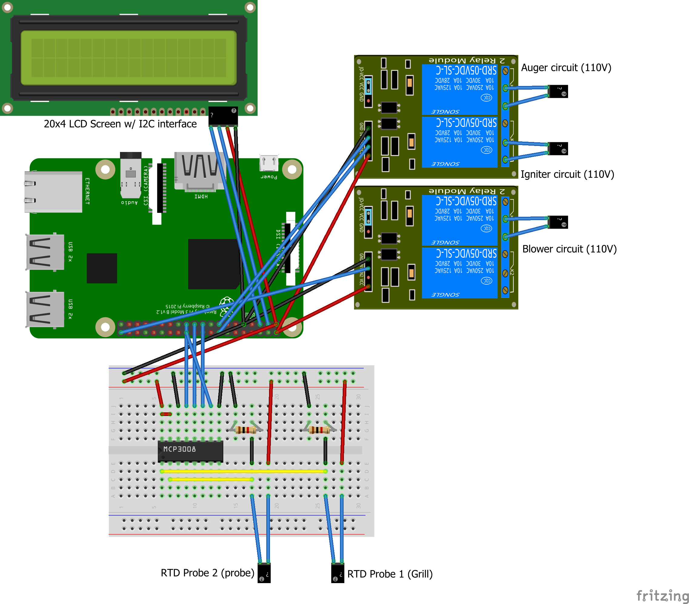

# Inferno
Wood pellet smoker powered by .NET Core and Raspberry Pi 3.  See the [photo album](https://1drv.ms/u/s!Ag9fVAifJI6dsrwlhf-iGDwD4qkaxw?e=BbMc6f)!

## Inferno.Api

This is the core functionality. It exposes all functionality as a web API. I run it on http://localhost:5000 and control it via a variety of tools.

## Inferno.Bot

A Skype bot for controlling the smoker. Designed for WAF. Built with Microsoft Bot Framework and hosted on Azure.

## Inferno.Cli

A command-line interface for the API.

## Inferno.Common

Common classes shared between projects.

## Inferno.RelayListener

Service that makes an outgoing connection to an Azure Relay Hybrid Connection and relays requests to API from the cloud.

## Inferno.TemperatureLogger

A tool I made for gathering telemetry. It polls the local instance of Inferno.Api and outputs temperature readings in a CSV format. I run it as a background task, piping the output to a file for later analysis in Excel.

## Hardware

